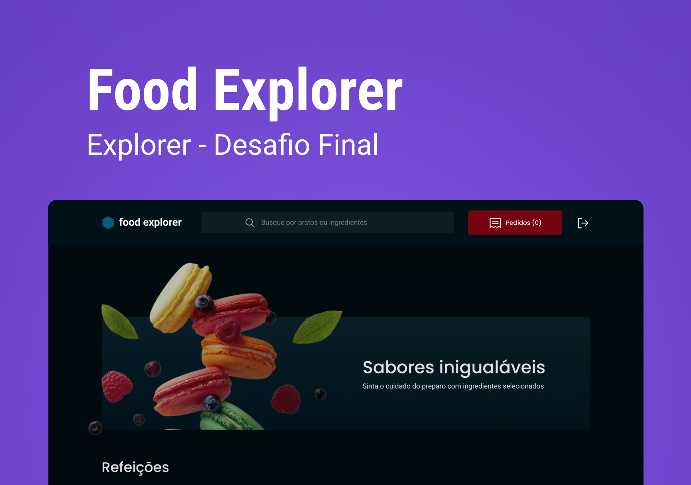

<h1 align="center"> Food Explorer (Back-end) </h1>

Aplicação para ser usada como cardápio digital ou menu interativo para um restaurante, lanchonete, etc.

  <a href="#-tecnologias">Tecnologias</a>&nbsp;&nbsp;&nbsp;|&nbsp;&nbsp;&nbsp;
  <a href="#-projeto">Projeto</a>&nbsp;&nbsp;&nbsp;|&nbsp;&nbsp;&nbsp;

  

 

  

## 🚀 Tecnologias

Esse projeto foi desenvolvido com as seguintes tecnologias:

- NodeJS
- Express
- SQLite
- Knex

## 💻 Projeto

- Desafio final do curso Explorer da Rocketseat.
- ⚠️Importante: Este projeto está utilizando uma hospedagem gratuita para o seu backend, portanto, pode haver atrasos no tempo de resposta do servidor.
##